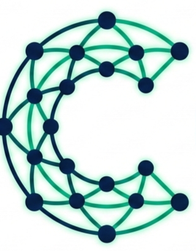
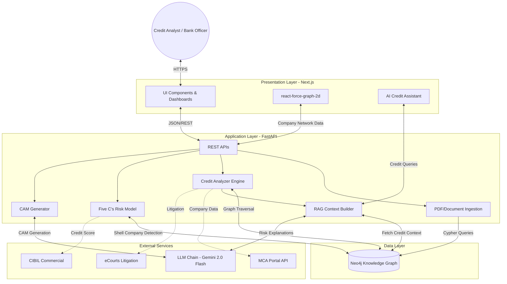

<p align="center">
    
</p>

# Intelli-Credit - AI-Powered Credit Appraisal System

Intelli-Credit is an intelligent credit appraisal engine using Neo4j Knowledge Graphs to assess corporate lending risk. It automates the Five C's of Credit analysis (Character, Capacity, Capital, Collateral, Conditions), detects shell companies, cross-verifies financial data, and generates comprehensive Credit Appraisal Memos (CAMs) — with LLM-powered risk explanations and an AI assistant that understands your entire credit portfolio.

---

## Video Presentation

[Watch the video](https://drive.google.com/file/d/1cSXTdYlhV6SeLbRbnMfHOqHaeGvPIsF9/view?usp=sharing)

## Test Credentials

| Field    | Value      |
| -------- | ---------- |
| Username | `admin`    |
| Password | `admin123` |

---

## Problem

Banks and NBFCs face mounting pressure to reduce credit appraisal turnaround time while maintaining rigorous risk assessment standards. Traditional manual processes involve:

- **Tedious Document Processing** — Manually extracting data from PDFs (bank statements, ITRs, financial statements)
- **Disconnected Verification** — Cross-checking revenue across ITR, bank deposits, and financial statements without a unified view
- **Hidden Risks** — Missing shell company networks, circular trading, and related-party transactions buried in transaction graphs
- **Inconsistent Analysis** — Five C's assessment varies by analyst experience; no standardized scoring framework
- **Slow CAM Generation** — Credit Appraisal Memos take days to compile from scattered data sources

---

## Solution

Intelli-Credit ingests financial documents, company filings, and external data into a Neo4j knowledge graph where companies, promoters, financial statements, and transactions become interconnected nodes. Credit analysis runs as graph-powered intelligence:

1. **Document Ingestion** — Upload bank statements, ITRs, balance sheets, P&L statements (PDF/JSON/CSV). Automated OCR and entity extraction.
2. **Knowledge Graph** — Companies, promoters, financial documents, litigation, and news articles linked as nodes with `PROMOTES`, `HAS_FINANCIAL`, `TRADES_WITH`, `HAS_LITIGATION` relationships.
3. **Credit Analysis** — Automated checks:
   - Revenue consistency (ITR vs bank deposits)
   - Debt servicing capacity (DSCR calculation)
   - Shell company detection (circular trading via graph cycles)
   - Revenue inflation detection (suspicious transaction patterns)
   - Cashflow analysis (working capital assessment)
4. **Five C's Scoring** — Composite scoring:
   - **Character** (30%) — Promoter background, litigation history, compliance track record
   - **Capacity** (25%) — DSCR, profitability trends, cashflow adequacy
   - **Capital** (20%) — Net worth, leverage ratios, equity contribution
   - **Collateral** (15%) — Asset backing, security coverage ratio
   - **Conditions** (10%) — Industry outlook, economic environment
5. **Credit Decision** — Risk-based loan amount calculation and interest rate determination with approval/rejection/conditional recommendations.
6. **CAM Generation** — Automated Credit Appraisal Memo with executive summary, financial analysis, risk assessment, and credit recommendation (PDF/HTML export).
7. **External Research** — Integrated data from:
   - MCA (Ministry of Corporate Affairs) filings
   - eCourts litigation search
   - CIBIL commercial credit scores
   - News sentiment analysis
8. **AI Assistant** — Context-aware chatbot answers questions about credit risk, company financials, and portfolio trends.

---

## Screenshots

### Dashboard — Real-time credit portfolio overview with approval rates, risk distribution, and loan metrics


### Credit Appraisal — Application-wise credit decisions with Five C's scores and risk indicators


### Company Graph — Visualize company networks, promoter relationships, and shell company detection


### Credit Risk Assessment — Composite risk scoring with AI-powered explanations and scorecards


### CAM Generator — Auto-generated Credit Appraisal Memos with LLM-powered insights


### Document Processing — Upload and parse bank statements, ITRs, financial statements (PDF support)


### AI Assistant — Context-aware credit analyst chatbot powered by the Knowledge Graph


---

## Architecture

```
PDF/JSON/CSV Upload (Bank Statements, ITRs, Financial Statements)
      |
      v
FastAPI Backend ──────── Neo4j Knowledge Graph
      |                        |
      ├─ Data Ingestion        ├─ Company nodes (CIN, name, industry)
      ├─ Credit Analyzer       ├─ Promoter nodes (PAN, shareholding)
      ├─ Credit Engine         ├─ FinancialDocument nodes
      ├─ PDF Processor         ├─ BankStatement / ITR nodes
      ├─ Research Agent        ├─ Litigation / NewsArticle nodes
      ├─ Bank Analyzer         ├─ LoanApplication nodes
      ├─ CAM Generator         ├─ PROMOTES edges
      ├─ Risk Model            ├─ HAS_FINANCIAL / HAS_LITIGATION edges
      └─ LLM Chain (Gemini)    └─ TRADES_WITH / RELATED_TO edges
      |
      v
Next.js Frontend (Tauri Desktop App)
      |
      ├─ Dashboard (Credit Metrics + Portfolio Analysis)
      ├─ Company Graph Explorer (react-force-graph-2d)
      ├─ Credit Appraisal Table (Five C's scores, risk indicators)
      ├─ Credit Risk Cards + Scorecards
      ├─ CAM Generator (PDF/HTML export)
      ├─ AI Credit Assistant (RAG chat)
      └─ Document Upload Hub
```

Frontend communicates with the backend via REST API. In production, reverse proxy routes `intellicredit.com` → Next.js and `api.intellicredit.com` → FastAPI.

---

## Key Features

**Knowledge Graph Credit Analysis** — Companies, promoters, financial documents, and transactions live as interconnected nodes in Neo4j. Credit analysis is graph traversal that detects hidden relationships, shell companies, and circular trading patterns.

**Shell Company Detection** — Finds closed loops in the `TRADES_WITH` relationship graph (A trades with B, B trades with C, C trades back to A with minimal operational substance) — a red flag for revenue inflation and phantom transactions.

**Five C's of Credit Scoring** — Automated composite scoring:
- **Character (30%)** — Promoter background verification, litigation history, compliance track record
- **Capacity (25%)** — DSCR calculation, profitability trends, cashflow adequacy
- **Capital (20%)** — Net worth analysis, leverage ratios, equity contribution assessment
- **Collateral (15%)** — Asset backing evaluation, security coverage ratio
- **Conditions (10%)** — Industry outlook analysis, economic environment assessment

**Revenue Cross-Verification** — Automated consistency checks between ITR declared revenue, bank statement deposits, and financial statement revenue. Flags discrepancies > 25% as high risk.

**LLM-Powered CAM Generation** — Complete Credit Appraisal Memos auto-generated using Gemini 2.0 Flash. Includes executive summary, company profile, financial analysis, Five C's assessment, risk indicators, and credit recommendation.

**AI Credit Assistant** — Context-aware chatbot that queries the knowledge graph to answer questions like "what's the DSCR for Company X?", "show me promoter litigation history", or "which companies have revenue mismatches?".

**Banking Conduct Analysis** — Automated bank statement parsing with pattern detection: cheque bounces, overdraft limit breaches, circular transactions, round-tripping.

**External Data Integration** — Pulls data from MCA filings, eCourts litigation database, CIBIL commercial scores, and news sentiment analysis to enrich credit profiles.

**Desktop App** — Ships as a native macOS/Windows/Linux app via Tauri v2. Also runs as a standard web app.

---

## Tech Stack

| Layer       | Technology                                                     |
| ----------- | -------------------------------------------------------------- |
| Desktop     | Tauri v2 (Rust)                                                |
| Frontend    | Next.js 14, TypeScript, Tailwind CSS                           |
| Charts      | Recharts (bar, pie, area), Nivo (Sankey)                       |
| Graph Viz   | react-force-graph-2d, D3.js force simulation                   |
| Backend     | Python 3.11, FastAPI, uvicorn                                  |
| Graph DB    | Neo4j 5.26 Community (Cypher queries, APOC plugin)             |
| LLM         | Google Gemini 2.0 Flash (primary), OpenAI (fallback)          |
| PDF Parser  | PyPDF2, pdfplumber, pytesseract (OCR)                          |
| Web Scraping| BeautifulSoup4, Selenium, httpx                                |
| Risk Model  | Five C's composite scorer with graph-based shell detection     |
| Data Models | Pydantic v2 (CIN validation, strict typing)                    |
| Deployment  | Docker Compose, Caddy, Let's Encrypt SSL                       |

---

## Getting Started

### Prerequisites

- Python 3.11+
- Node.js 18+
- Docker (for Neo4j)
- Google Gemini API key (or OpenAI API key as fallback)

### Quick Start

```bash
# 1. Start Neo4j
docker compose up neo4j -d

# 2. Backend
cd backend
uv sync
uv run python -m uvicorn app.main:app --reload --reload-dir app    # runs on :8000

# 3. Frontend
cd frontend
npm install
npm run dev                              # runs on :3000

# 4. Generate and seed sample credit data
python3 data/generator/mock_credit_data.py
python3 data/generator/seed_credit_neo4j.py
```

Open http://localhost:3000 and explore the credit appraisal dashboard.

### Desktop App (Tauri)

```bash
cd frontend
npm run tauri:dev       # development
npm run tauri:build     # production binary
```

### Full Stack (Docker Compose)

```bash
docker compose up -d    # neo4j + backend + frontend + caddy
```

### Configuration

Settings are read from `backend/.env`:

| Variable         | Default                          | Description                        |
| ---------------- | -------------------------------- | ---------------------------------- |
| NEO4J_URI        | bolt://localhost:7687            | Neo4j connection                   |
| NEO4J_USER       | neo4j                           | Neo4j username                     |
| NEO4J_PASSWORD   | creditappraisal2026              | Neo4j password                     |
| GEMINI_API_KEY   | (required)                       | Google Gemini API key (primary)    |
| OPENAI_API_KEY   | (optional)                       | OpenAI key (fallback)              |
| LLM_PRIORITY     | gemini,openai,ollama             | LLM fallback order                 |
| CIBIL_API_KEY    | (optional)                       | CIBIL commercial API               |
| MCA_API_KEY      | (optional)                       | MCA portal API key                 |
| ECOURTS_API_KEY  | (optional)                       | eCourts litigation API             |

LLM is required for CAM generation and risk explanations. External APIs (CIBIL, MCA, eCourts) are optional and will return stub data if not configured.

---

## API

| Method | Path                                 | Description                                    |
| ------ | ------------------------------------ | ---------------------------------------------- |
| POST   | /api/data/upload                     | Upload financial data (JSON/CSV/PDF)          |
| POST   | /api/documents/upload                | Upload & parse PDFs (bank statements, ITRs)   |
| POST   | /api/appraisal                       | Trigger credit appraisal for loan application |
| GET    | /api/appraisal/results               | Paginated appraisal results with filters      |
| GET    | /api/appraisal/graph/company-network | Company network graph (hub view)              |
| GET    | /api/appraisal/graph/shell-companies | Detect shell companies via circular trading   |
| POST   | /api/appraisal/quick-score           | Quick credit score (lead qualification)       |
| POST   | /api/cam/generate                    | Generate Credit Appraisal Memo (CAM)          |
| GET    | /api/cam/export/{id}/pdf             | Export CAM as PDF                             |
| GET    | /api/risk/companies                  | All companies with credit risk scores         |
| GET    | /api/risk/companies/{cin}/five-cs    | Five C's analysis for a company               |
| GET    | /api/risk/companies/{cin}/scorecard  | Detailed credit scorecard                     |
| GET    | /api/research/news                   | Company news sentiment analysis               |
| GET    | /api/research/mca                    | MCA filings and compliance status             |
| GET    | /api/research/litigation             | eCourts litigation search                     |
| GET    | /api/research/cibil                  | CIBIL commercial credit score                 |
| POST   | /api/banking/analyze                 | Analyze bank statement transactions           |
| POST   | /api/banking/revenue-verification    | Cross-verify ITR vs bank deposits             |
| GET    | /api/stats/dashboard                 | Dashboard KPIs (approval rate, portfolio)     |
| GET    | /api/stats/portfolio-analysis        | Industry/size breakdown                       |

---

## Knowledge Graph Schema

**Nodes:**
- `Company` — keyed on CIN (Corporate Identification Number)
- `Promoter` — keyed on PAN (director/founder of company)
- `FinancialDocument` — balance sheets, P&L, cashflow statements
- `BankStatement` — monthly bank account statements
- `ITR` — Income Tax Returns filings
- `FinancialStatement` — audited financial statements
- `LoanApplication` — loan requests with approval/rejection status
- `Litigation` — court cases involving company/promoters
- `NewsArticle` — news mentions with sentiment scoring

**Relationships:**
- `PROMOTES` (Promoter → Company) — ownership/directorship
- `HAS_FINANCIAL` (Company → FinancialDocument) — financial records
- `HAS_BANK_STATEMENT` (Company → BankStatement) — banking records
- `HAS_ITR` (Company → ITR) — tax filings
- `HAS_APPLICATION` (Company → LoanApplication) — loan requests
- `HAS_LITIGATION` (Company → Litigation) — legal cases
- `TRADES_WITH` (Company → Company) — business relationships
- `RELATED_TO` (Company → Company) — group company linkage

---

## Deployment

Production deployment uses Docker Compose + Caddy reverse proxy:

```bash
# Build and deploy
docker compose up -d

# Caddy handles SSL termination automatically via Let's Encrypt
# Frontend: intellicredit.com
# API: api.intellicredit.com
```

---

Built for Corporate Lending Credit Appraisal — AI-Powered Risk Assessment using Knowledge Graphs
